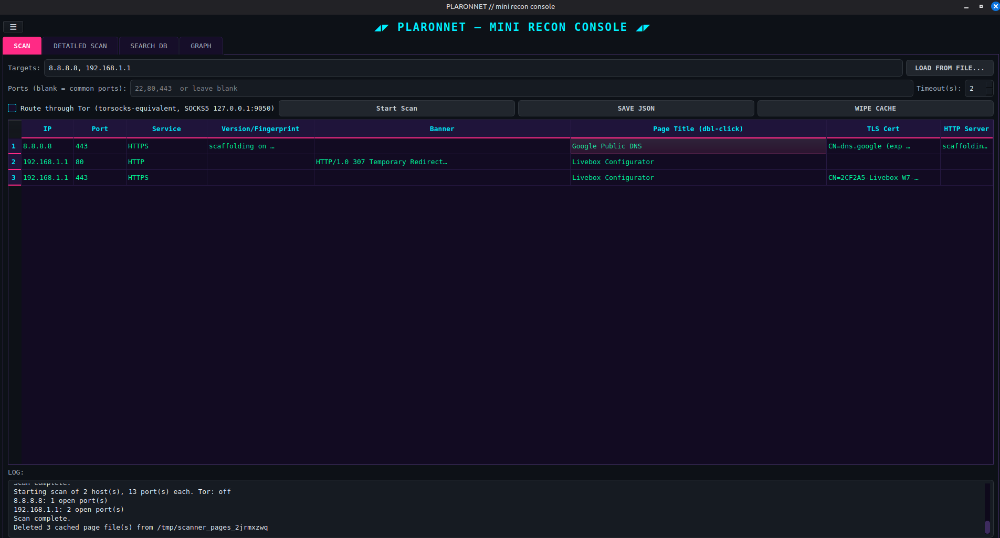
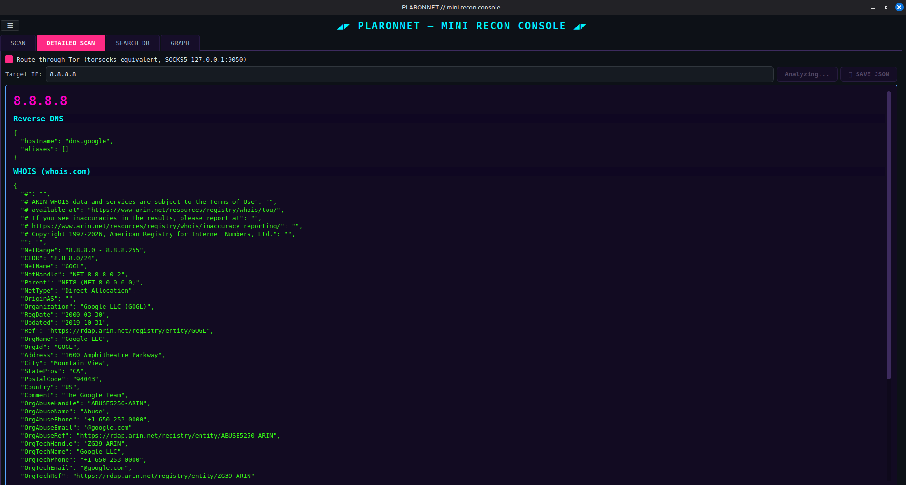
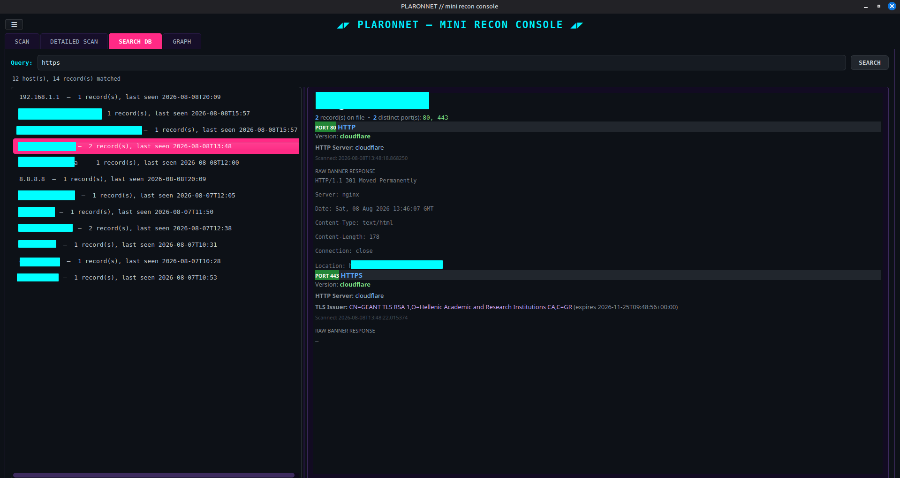
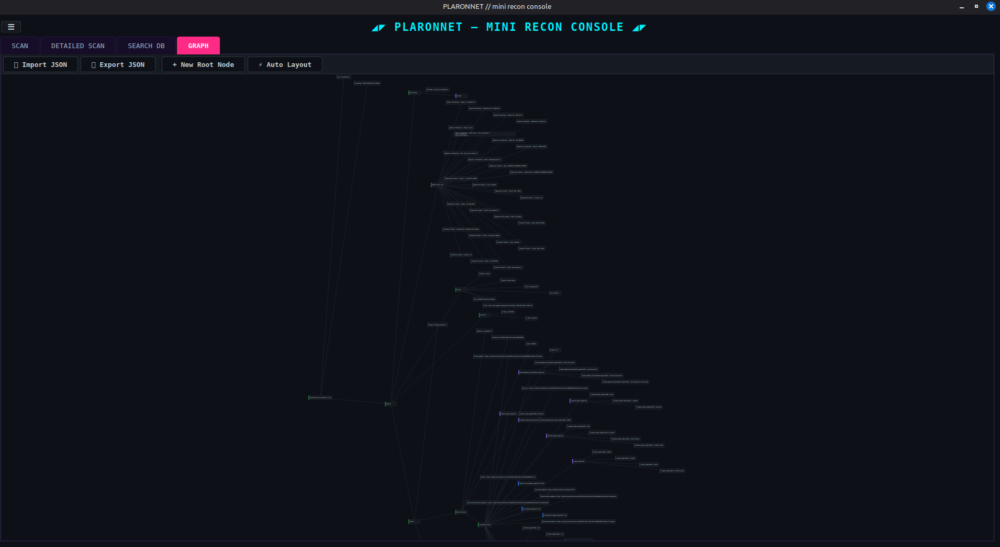
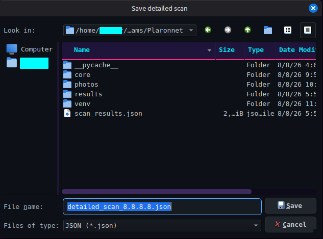

# Plaronnet
Plaronnet - a desktop network reconnaissance tool with a PyQt5 GUI, built for scanning networks. 
It combines concurrent port scanning, passive OSINT lookups, and a searchable local database into a single
cyberpunk-themed console.

## Modules
### 1. SCAN — fast multi-host, multi-port scanning (MiniShodan)
- Scan any number of targets (individual IPs, hostnames, or ranges like
  `192.168.1.10-20`) across any list of ports, or fall back to a curated list
  of common ports (FTP, SSH, Telnet, SMTP, HTTP/S, MySQL, RDP, PostgreSQL,
  Redis, MongoDB).
- **Load targets from a `.txt` file** — one host per line.
- **Banner grabbing** on every open port, with **version fingerprinting**
  parsed from the banner itself (SSH version strings, FTP/SMTP welcome
  banners) — no active OS-fingerprinting or packet-crafting, just reading
  what the service already sends.
- **Optional Tor routing** (SOCKS5, torsocks-equivalent) for the whole scan.


### 2. DETAILED SCAN — single-IP OSINT profile
Enter one IP and run a passive analysis:
| Module | What it does |
|---|---|
| Reverse DNS | Resolves hostname + aliases |
| WHOIS (whois.com) | Scrapes registry/domain WHOIS data — both raw registry blocks and structured domain records |
| Geolocation | Country, region, city, ISP, org, coordinates |
| Wayback URLs | Site's urls saved by wayback machine |
| Tenant | Domain ownership, tenant ID, and organization metadata |


### 3. SEARCH DB — a searchable history of every scan
- All scan results persist in a local **SQLite database**
  (`~/.mini_scanner/scans.db`), deduplicated: re-scanning the same host:port
  updates its existing record instead of piling up duplicates.
- Free-text search across IP, banner, service, version, and HTTP headers.
- Results are grouped by host and rendered as a **Shodan-style host profile
  page** — not a flat table — showing every open port's service, version,
  TLS info, and banner in one readable view per host.


### 4. Graph - visualize your data
- Import json file to build a graph
- Hold Shift and drag a line from one node to another to create an edge on mouse release.
- "Auto Layout" button to the toolbar that automatically positions all nodes into a tidy tree structure using a recursive layout algorithm.
- Export json file to save your graph



## Installation
**1. Clone the repository**
```bash
git clone https://github.com/fenfoe/Plaronnet.git
cd Plaronnet
```
**2. Activate virtual environment**
```bash
python3 -m venv venv
source venv/bin/activate
```

**3. Install dependencies**
```bash
pip install -r requirements.txt
```

## Usage 
```bash
# Launch GUI
python3 scanner_gui.py
```

## Disclaimer
This tool is for educational purposes only. Use of this tool is at your own risk. The author is not responsible for any outcomes resulting from its use.
